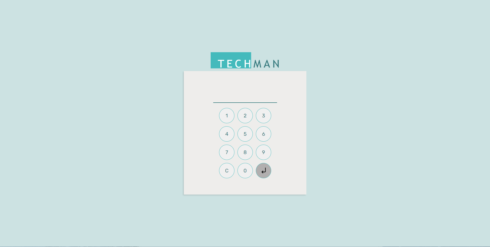
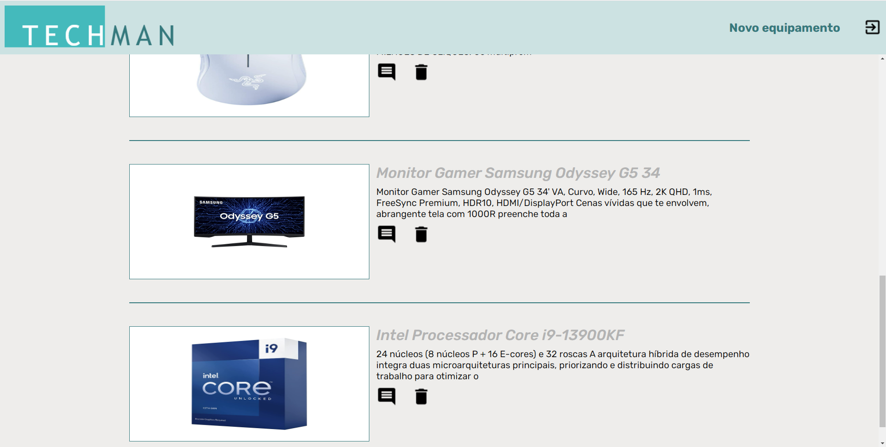

# Projeto TechMan
- documentação seguida : https://github.com/wellifabio/senai2023/tree/main/3des/01-proj/aula17
## back (express mongoose) e front html, css, js
- Requisitos
    - Node.js: https://nodejs.org/
    - MySQL: https://www.mysql.com/
- Executar
    - Clonar este repositório
    - Abrir com VsCode **code .**
    - Na pasta /back:
        - Criar um arquivo **.env** com o conteúdo a seguir
        ```env
        DATABASE_URL="mysql:root:@localhost:3306/techman"
        ```
    - Abrir o terminal **CTRL + J"**
        ```cmd
        cd Back
        npm i
        nodemon
        ```
        
    - Abra a pasta /docs
        - entre na pasta sql e faça alterações de path nas linhas 'LOAD DATA INFILE' 
        - faça a importação dos dados via terminal xampp ou http://localhost/phpmyadmin
    - Abra a pasta /front
        - Execute o index.html com o Live Server (Extensão do VsCode)
        


